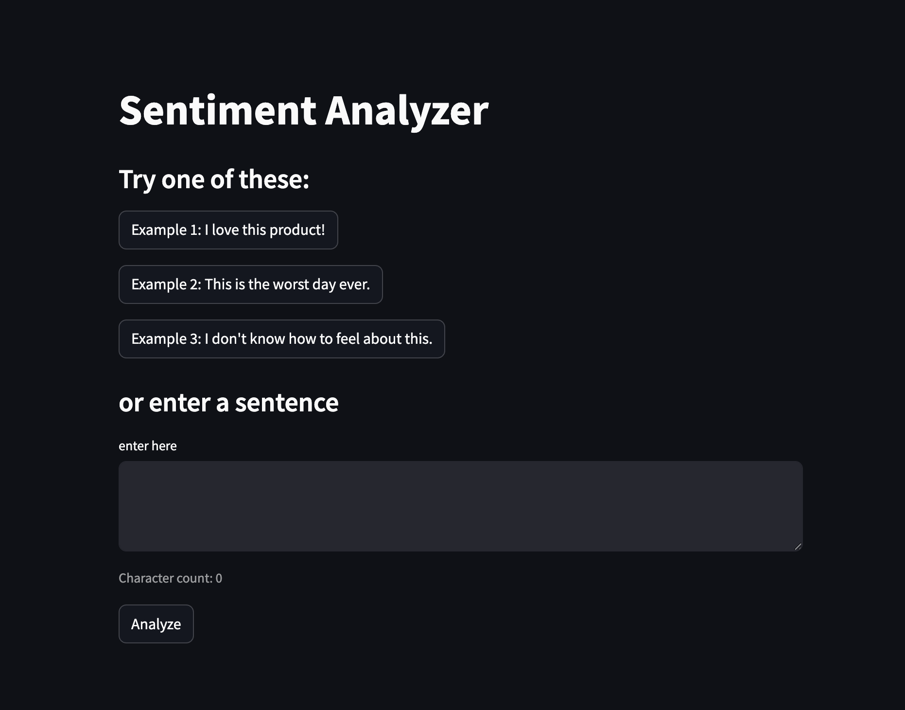

# PBL Project: Sentiment analysis model for analyzing tweets on X

 This ML model uses <strong>Logistic regression</strong> to analyze tweets and predict whether it's sentiment is positive or negative. 
The project is trained on <a href = "https://www.kaggle.com/datasets/kazanova/sentiment140">Sentiment140</a> dataset and has been deployed via Streamlit.

# Preview of the project

